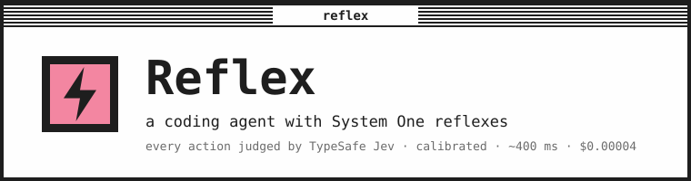

<p align="center">
  
</p>

<p align="center">
  <strong>A coding agent and personal assistant that thinks with an LLM and reacts with TypeSafe.</strong><br>
  A calibrated System One model checks each tool call, turn and voice transcript in about 400 ms, and code decides what happens next.
</p>

<p align="center">
  <a href="#quick-start"></a>
  <a href="https://typesafe.ai"></a>
  <a href="https://github.com/earendil-works/pi"></a>
  <a href="LICENSE"></a>
</p>

Reflex is built on the [Pi coding agent](https://github.com/earendil-works/pi). It works with any
LLM through OpenRouter or a direct provider, takes voice input (Sarvam AI by default), and
includes macOS computer use, a browser agent, MCP connectors, scheduled agents and deploys.
On top of that sits a reflex layer that uses Jev, the System One model from
[TypeSafe](https://typesafe.ai). Jev answers narrow, typed questions with calibrated
probabilities in a few hundred milliseconds and produces no text of its own. Reflex's code acts
on those numbers.

```
System Two   LLM (any model, via OpenRouter)   writes code, reasons, plans, talks
System One   TypeSafe Jev                      judges every action, turn, utterance, request
Code         Reflex                            owns the policy: thresholds, escalation, routing
```

## How TypeSafe is used

Each time Reflex consults Jev, the session shows a pink `⚡ TYPESAFE` line with what was asked
and what came back.

| Where | Questions Jev answers (one parallel request each) | What the code does with the numbers |
|---|---|---|
| Action gate on every `bash`, `edit`, `write`, `computer`, `browse` and connector call | destructive? outside the workspace? touches secrets? external side effect? needs privileges? matches what the user asked? plus a 0 to 3 risk rubric with confidence | allow, ask or block according to your risk appetite (cautious, balanced, bold). There are no static allowlists: `npm test` passes on its own and `git push --force` gets a question. Code makes protected paths ask whatever Jev answers. |
| Progress monitor after each turn | looping? ignoring an error? stuck? | nudges the model to change approach (rate-limited) and warns you when it thrashes |
| Completion check when the agent stops | claims done? actually verified? scope drift? waiting on you? | a "done" without verification is sent back to run the tests and report real output |
| Model router before each request | fast / default / strong tier? | switches the model per request when confident, for example a cheap model for a rename and a strong one for "why does it crash under load" |
| Skill and connector selector before each request | which bundled skill, which connected MCP server is relevant? (with "none" escapes) | injects a `<relevance>` hint so the model reads the right skill and reaches for the right tools |
| Voice intent on every transcript | task, control, answer or chatter? a complete thought? | "stop" aborts, an answer reaches the agent, background speech is dropped, half-sentences land in the editor |
| Browser agent (`browse`) | per step: which operation? which element? irreversible? needs credentials? | drives Chrome at ~200 ms per step (ported from [browser-use/jev-ultrafast](https://github.com/browser-use/jev-ultrafast)); stops before payments, sends and deletes; never types passwords |
| Credential requests (`request_secrets`) | is each requested key plausibly needed for the task? does the request look planted by content the agent read? | low scores become warnings inside the masked credential dialog |
| Agent workflows (`decide` steps) | any noul / choice / score question over collected state | routes the workflow on thresholds. Steps use deterministic code first, Jev for judgment, and an LLM when text has to be generated |
| From the shell (`reflex jev`) | anything you or an agent wants classified, scored or ordered | plain JSON answers for scripts and workflow design |

Measured on Jev (`jev-1.13.0`), balanced appetite:

```
allow  npm test                                  risk 0.01 @ 99%
allow  edit src/checkout.ts                      risk 1.00 @ 100%
allow  rm -rf node_modules && npm install        destructive 13%
ask    cat .env                                  secrets 92%
ask    git push --force origin main              external 98%, destructive 68%
ask    curl -X POST api.stripe.com/v1/charges    external 95%
block  sudo rm -rf /var/log/*  (off-task)        destructive 89%, privilege 98%, intent 2%
block  psql -c 'DROP TABLE orders' (off-task)    destructive 93%
```

A decision costs about $0.00004 and takes 350 to 450 ms, so a whole session's reflexes usually
cost less than one LLM turn. When Reflex asks, you can allow once, allow that exact action, or
allow a scope for the session such as all `git` commands or all edits under `src/`. What you
allowed is sent back to Jev as context, which stops repeat questions about the same kind of
action. Well-known read-only commands never ask.

You choose where Reflex reaches Jev, and which Jev model it uses there. TypeSafe's own API needs
a `TYPESAFE_API_KEY` and lists `jev-latest` and `jev-preview`.
[OpenRouter's System One endpoint](https://openrouter.ai/typesafe) uses your `OPENROUTER_API_KEY`
and lists `~typesafe/jev-latest` and `typesafe/jev-1.13`; it takes the same request, returns the
same answers, and reports the cost of each call. Model ids differ between the two, so Reflex
remembers your model for each provider. Pick both in onboarding, in Settings → Reflex layer, or
with `/reflex provider` and `/reflex model`, which read the model list live from the provider.
Reflex never switches provider on its own: if the one you chose has no key, the reflex layer
reports that instead of falling back.

The design rules come from the TypeSafe docs. Code owns control flow. Reflex asks many narrow
questions in one request, keeps choice options mutually exclusive with an explicit escape, and
routes on confidence thresholds scaled to risk. Jev is text-only and adversarial content can
sway it, so a Jev answer can add a question or a block but cannot remove one that code imposed.

## Quick start

Requires Node ≥ 22.19 on macOS or Linux, and `ffmpeg` (or `sox`) for voice.

```bash
git clone https://github.com/kaustav1996/reflex && cd reflex
npm install && npm run build
npm link          # installs the `reflex` command
reflex            # first run starts onboarding
```

Onboarding asks for three things, or picks them up from your environment or a `.env`:

1. A language model, in one of three ways. An API key: OpenRouter (one key for every model),
   Anthropic, OpenAI, Gemini, Groq, xAI, DeepSeek or Mistral. A subscription sign-in: Claude
   (Pro or Max), ChatGPT (Plus or Pro) or GitHub Copilot, through the provider's own browser
   login. Or your own OpenAI-compatible endpoint, such as Ollama, LM Studio, LiteLLM or vLLM.
   Pi stores credentials in `~/.reflex/agent/auth.json` and endpoints in `models.json`.
2. Where to reach Jev (TypeSafe directly or OpenRouter), the Jev model to use there, and your
   risk appetite. OpenRouter can reuse the key from step 1.
3. A voice provider: Sarvam (22 Indian languages and English, with language detection and
   optional translation to English), OpenAI, Groq, Deepgram, or local whisper.cpp.

The same choices are in the web UI under Settings → LLM access: sign in or out of a
subscription, and add an endpoint by base URL (Reflex asks the server for its models). The
sign-in is Pi's built-in flow, and whether a subscription may be used from third-party tools is
up to that provider's terms. Jev is separate and always comes from TypeSafe or OpenRouter.

Run `reflex setup` to change any of this and `reflex doctor` to check the installation.

## Everyday use

```bash
reflex                                   # interactive, in the current project
reflex web                               # browser interface, multiple sessions as tabs
reflex -p "summarize this repo"          # headless
reflex --reflex bold -p "…"              # headless with a bolder gate
reflex --assistant                       # start with macOS computer-use tools on
reflex --model openrouter/moonshotai/kimi-k2.7-code   # any Pi flag works
```

| In a session | |
|---|---|
| `/reflex` | policy: `appetite cautious\|balanced\|bold`, `provider typesafe\|openrouter`, `model [id]`, `gate`, `monitor`, `route`, `select`, `verbose`, `routing fast=… default=… strong=…`, `stats`, `last` |
| `/voice` or ctrl+shift+v | push-to-talk; Enter transcribes, Esc cancels; `/voice send`, `/voice lang hi-IN`, `/voice translate`, `/voice provider groq` |
| `/browse <goal>` | run a web task with the System One browser agent and watch the steps |
| `/computer on` | `screenshot` and `computer` tools: open apps, read the accessibility tree, click, type, AppleScript; every action gated |
| `/models [filter]` | pick a model with context size and price per million tokens |
| `/secrets`, `/artifacts`, `/mcp`, `/setup` | credential names known to the session, deployed artifacts, connector status, keys |
| `/model`, `/thinking`, `/resume`, `/fork`, … | everything Pi offers |

The footer reads `⚡ reflex balanced 12 auto · 2 asked · 0 blocked · ~380ms` and `🎤 sarvam`.

## Web interface

`reflex web` serves a local page (http://127.0.0.1:7331, loopback only, per-launch token) in the
typesafe.ai look. Each session tab is its own `reflex --mode rpc` process, so the reflex layer,
browsing, computer use and every Pi command behave as they do in the terminal.

The Sessions tab lets you pick a project folder from a browser instead of typing a path. Tool
calls are grouped into collapsible rows and screenshots render inline. The composer has a mic
button, image and file attachments and a `/` command menu. Messages sent while the agent works
are queued, and a stop button appears beside send. Sessions running in a terminal show up as
live read-only transcripts, and earlier sessions can be resumed in a tab.

The Agents tab holds scheduled, webhook-driven and chained jobs with their runs and logs. The
Artifacts tab deploys app folders to your own Netlify and Render accounts. Settings, at the
bottom of the sidebar next to the light/dark toggle, has one page each for keys, reflex policy,
voice, browser, look, artifact defaults, packages, skills, connectors and the call logs.

## Agents and workflows

The Agents tab (and `reflex agent …`) turns a prompt plus instructions into a job. A job can be
triggered by cron (`0 9 * * 1-5`, `@daily`), by a local webhook
(`POST http://127.0.0.1:7331/hooks/<id>/<secret>`), or by hand. Every trigger creates a run,
which is a headless Reflex session in the agent's own directory, so runs stay out of your
session list. An agent can call other agents when it succeeds, or curl another agent's webhook
for a conditional pipeline. The scheduler runs inside `reflex web`, so schedules fire only while
it is running.

An agent can be a workflow instead of one prompt. Steps are chosen in this order of preference:

1. `shell`: deterministic code for anything with a known algorithm;
2. `decide`: a TypeSafe question over the collected state, routing on thresholds;
3. `llm`: a headless Reflex session, only for generation or open-ended reasoning;

There are also `call` steps for another agent and `end` steps. Routing is data
(`route: [{ "when": "verdict.failed.noul >= 0.6", "next": "fix" }]`), and each step's result is a
variable that later steps can use.

A `decide` step rebuilds its questions every time it runs. Instructions and options are
templates, a choice can take its options from a list variable (`optionsFrom`), and `forEach`
scores every item of a list in parallel and returns a ranked shortlist, which is the "filter in
code, score the rest, choose among the shortlist" pattern. Routes can test an answer's
confidence, so an unsure decision goes to a review step.

Runs have hard stops. `limits` caps spend, TypeSafe calls, LLM runs and steps for one run, and the
run record carries what it cost. Progress is saved after every completed step, so
`reflex agent resume <agent> <run>` continues an interrupted run without repeating finished
steps. Webhook senders can pass an idempotency key so a retry does not start a second run.

Every agent has a workflow diagram in the Agents tab. It shows the triggers, each step coloured
by kind, the routes that TypeSafe answers decide in pink, and any chained agents. Nodes light up
as a run executes, and `reflex agent diagram <id>` prints the same graph as Mermaid. You can ask
any session to build an agent; the bundled `reflex-agents` skill teaches the model the format,
the step order of preference and how to sequence activities.

```bash
reflex jev --state "Activity: check the build log for new warnings" \
  --choice "kind: shell|decide|llm" "Cheapest step type that can do this reliably?"
```

## Artifacts: deploy with your own accounts

`reflex artifact deploy <folder>`, the Artifacts tab, or the `deploy_artifact` tool publishes an
app using your own Netlify, Render and GitHub accounts. Reflex runs on your machine, so it uses
the logins your machine already has:

| Part | Comes from |
|---|---|
| Frontend, a Netlify site at `rx-<name>.netlify.app` or `<name>.<DEPLOY_DOMAIN>` | `netlify login` (the CLI's saved session); optional `DEPLOY_DOMAIN` for your own domain on Netlify DNS |
| Backend, a free Render web service | `render login` (the CLI's saved session and active workspace); optional `RENDER_REGION` |
| Backend source, since Render builds from git | `gh auth login`; `ARTIFACTS_REPO_PRIVATE=true` for private repos |

When a provider is not connected, `deploy_artifact` and the Artifacts tab offer the CLI login
first. That goes through browser consent, so there is nothing to paste. A token is the
fallback. Tokens
(`NETLIFY_API_KEY`, `RENDER_API_KEY`, `GITHUB_TOKEN`) are for CI or a future remote runner and
live in `~/.reflex/.env`; set `ARTIFACTS_<PROVIDER>_AUTH=env` to prefer them over a CLI login.

The pipeline is deterministic and streams each step as it runs: read or detect the manifest, push the
backend to GitHub, create or update the Render service, deploy the pinned commit, wait for
`/health`, build the frontend with the backend URL injected, zip, publish to Netlify, wait for
the certificate. Layout is detected without a manifest; `reflex-artifact.json` overrides it.

### SQLite on Render's free plan

Free Render instances lose their disk when they spin down. Reflex therefore starts the backend
under a small Python sidecar. On boot the sidecar restores the database from Netlify Blobs, and
whenever the file changes it takes a consistent `sqlite3` backup, gzips it and uploads it
through a signed URL. The snapshot lives in the artifact's own Netlify site, so no other service
is needed. Defaults live in Settings → Artifacts, and each artifact can override its domain,
region and repo visibility.

## Credentials and logs

### Keys stay out of the chat

When a project needs a key, the agent calls `request_secrets`. Reflex opens a masked form in the
terminal or the browser and writes the value to the project's `.env`. It also exports the value
to the session and adds `.env` to `.gitignore`. The model is told only the name, a masked
preview and the length, and Reflex scrubs known secret values from every later tool result.
Fields you leave blank come back as skipped, so the agent can ask again for those.

### Call log

Every session and agent run appends its outbound calls to `~/.reflex/logs/calls.jsonl`. A
TypeSafe entry has the purpose, state, questions, answers, tokens and latency. An LLM entry has
the model, tokens, cost, stop reason and tool calls. Voice transcriptions and browser steps are
logged too. Settings → Logs shows the entries as collapsible rows with filters, search and a
live tail. Before a line is written, known secrets are replaced by `[SECRET:NAME]` and anything
that looks like a credential by `[SECRET:#hash]`. The hash is stable, so one value always masks
to the same tag.

## Connectors, skills, packages

Connectors are MCP servers. Reflex knows the official endpoint and sign-in method of the common
ones, so one command connects them:

```bash
reflex connect gmail | gdrive | gcalendar | slack | atlassian | linear | figma | strava
reflex connect datadog | sentry | supabase | vercel | netlify | posthog        # OAuth remotes
reflex connect render --key rnd_xxx                                            # API key
reflex connect railway | excalidraw                                            # local stdio
```

OAuth remotes are bridged through `npx -y mcp-remote`, which asks for browser consent once and
caches the token in `~/.mcp-auth/`. Google Workspace servers need your own OAuth client
(`GOOGLE_OAUTH_CLIENT_ID` / `GOOGLE_OAUTH_CLIENT_SECRET`), and Figma and Vercel admit only
allow-listed clients. You can add any other server by command or URL. Every connector tool
becomes a Reflex tool named `<service>__<tool>` and goes through the same gate as the built-in
tools.

Skills are `SKILL.md` folders. Reflex bundles five and refreshes them on every start: `reflex`
(how to behave when the gate asks or the monitor nudges), `reflex-agents`, `reflex-artifacts`,
the official [TypeSafe agent skill](https://github.com/typesafe-ai/skills) and
[humanizer](https://github.com/blader/humanizer). You can add more from any GitHub repo in
Settings → Skills. Packages are Pi packages from npm or git
(`reflex install git:github.com/user/repo`).

## Look

The TUI and the web page use the typesafe.ai palette: near-black `#1e1e1e`, off-white `#fefefe`,
pink `#f386a1`, green `#03aa5c`, teal `#09aea1`, magenta `#d45bb6`, with a System-1-style striped
window header. Themes `typesafe` and `typesafe-light` are installed into `~/.reflex/agent/themes`.

## Architecture

```
src/cli.ts                    entry: .env → ~/.reflex isolation → onboarding → Pi main() with inline extensions
src/extensions/typesafe/      the reflex layer
  client.ts                     System One client: fetch, retries, stats, answer validation, call logging
  policy.ts                     pure: the questions, thresholds per appetite, decide()  (unit-tested)
  gate.ts                       tool_call hook: describe → Jev → allow / ask / block, session scopes
  monitor.ts                    turn_end / agent_end hooks: loops, ignored errors, unverified completion
  router.ts · selector.ts       model tier per request · relevant skill and connector per request
src/extensions/voice/         recorder (ffmpeg/sox → WAV), Sarvam / OpenAI / Groq / Deepgram / whisper.cpp
src/extensions/browser/       DevTools client, DOM snapshot, Jev-driven step loop, browse tools
src/extensions/computer/      macOS screenshot and computer tools
src/extensions/secrets/       request_secrets: masked dialogs, .env writes, output redaction
src/extensions/mcp/           MCP client (stdio + streamable HTTP), connector presets, `reflex connect`
src/extensions/artifacts/     deploy_artifact / list_artifacts / delete_artifact tools
src/agents/                   agent store, cron, headless runner, workflow engine, scheduler, CLI
src/artifacts/                manifest detection, Netlify, Render, GitHub, persistence sidecar, deploy pipeline
src/logs/                     the masked call log
src/web/ + web/app.html       `reflex web`: HTTP + SSE server, one `reflex --mode rpc` process per tab
skills/ · themes/             bundled skills and the typesafe themes
```

Config lives in `~/.reflex/reflex.json`, Pi state in `~/.reflex/agent/`, non-LLM keys in
`~/.reflex/keys.json`, project keys in `.env` files, logs in `~/.reflex/logs/`.

## Development

```bash
npm run dev -- -p "hello"     # run from source with tsx
npm run typecheck
npm test                      # policy thresholds, gate helpers, manifests, masking, sidecar, presets …
```

## Limits

- Jev is text-only, does no arithmetic or date math, and adversarial content can sway it. Code
  checks protected paths and the per-signal thresholds before it looks at the risk score, so a
  Jev answer cannot remove those guards.
- In a headless run nobody can answer a question. An action that would make Reflex ask is
  blocked there, with one exception: when no signal fired and only the risk score is low
  confidence, the action is allowed and logged.
- Calibration is population-level. The thresholds in `policy.ts` were tuned on a small set of
  realistic actions, so tune them on your own logs.
- Computer use is macOS-only and needs Accessibility and Screen Recording permission for the
  terminal app that started Reflex.
- Voice is batch transcription over REST. Sarvam audio is split into chunks of at most 29 s,
  and the other providers receive the whole recording in one request. Streaming is not
  implemented.
- Schedules and webhooks run only while `reflex web` is running.
- Artifact deploys depend on your providers' free tiers. Render free services sleep after
  inactivity and take about 30 s to wake. Backend repos are public unless
  `ARTIFACTS_REPO_PRIVATE=true`. The snapshot sidecar needs your Netlify token, so that token is
  stored in the Render service's environment; use a token you are comfortable placing there.
- Reading the saved sessions of the Netlify and Render CLIs was tested against their documented
  file formats, not against live logins.

## Acknowledgements

[Pi](https://github.com/earendil-works/pi) for the agent runtime, [TypeSafe](https://typesafe.ai)
for Jev and the System One design rules, [browser-use/jev-ultrafast](https://github.com/browser-use/jev-ultrafast)
for the browser agent design, [typesafe-ai/skills](https://github.com/typesafe-ai/skills) and
[blader/humanizer](https://github.com/blader/humanizer) for the bundled skills.

MIT licensed.
